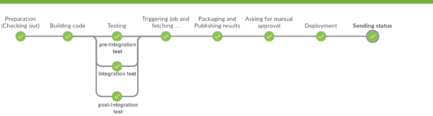
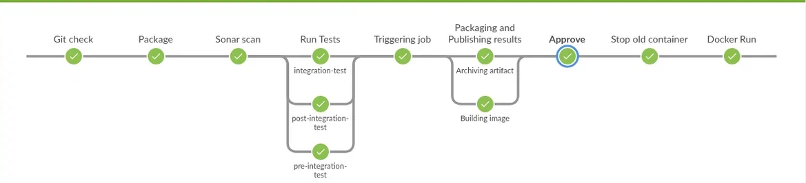

## Create Jenkinsfile, that will do the following ##
### 1) Checking out code from repo ###
### 2) Build code ###
### 3) Sonar scan ###
### 4) Teset with parallel execution (pre-integration test; integration test; post integration test) ###
### 5) Main job should start the child ones, wait for its completion and take created artefact ###
### 6) Package (2 parallel job: 1st) Take an artifact from the previous step ( .war file ) and store it to Nexus repo; 2nd) Create Docker Image and push it to Nexus )
### 7)  Ask for manual approval ###
### 8) Deploy to k8s with following param.: Namesapce: {custom}; Deployment; Service; Ingress rule; Rolling update; Zero downtime / Or Deploy ro Docker ###
### 9) Feedback stage (The message (feedback) should be sent by email with proper error description: failed stage, what has happened , when … etc. If pipeline status is ‘Success’ – send final email about this as well) ###
## EXAMPLE 1##

## EXAMPLE 2##

